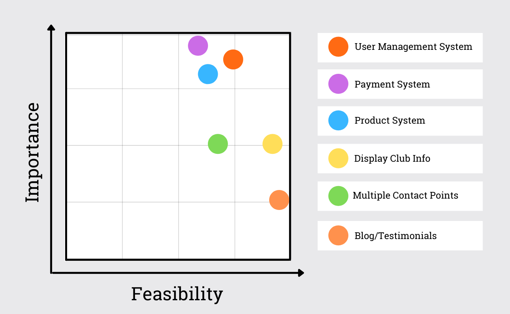
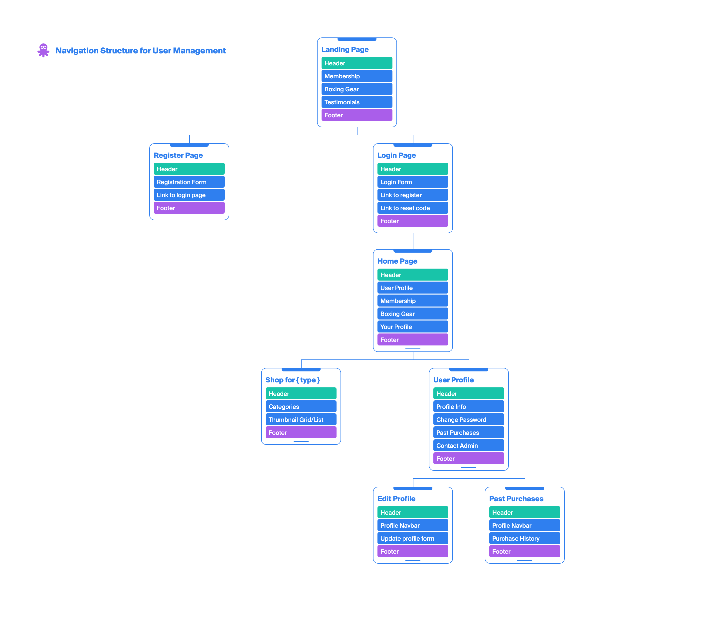
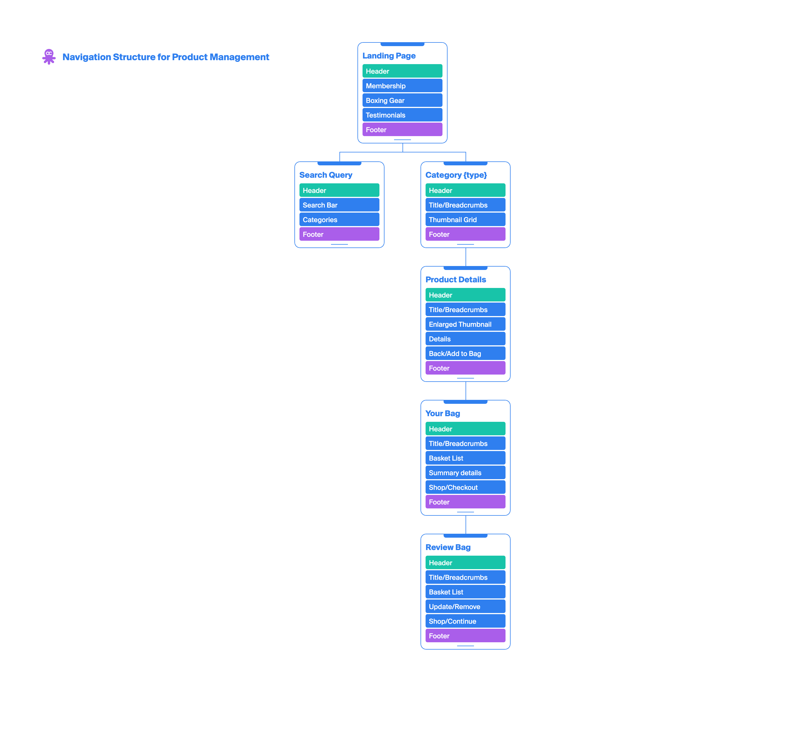
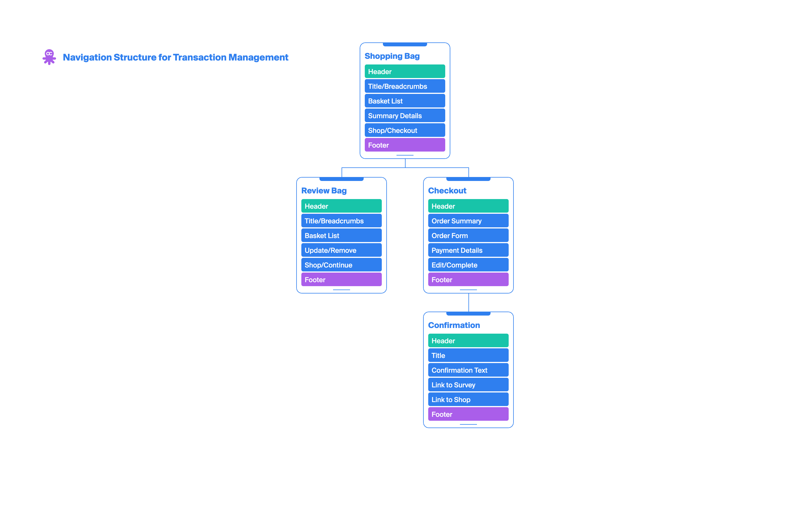
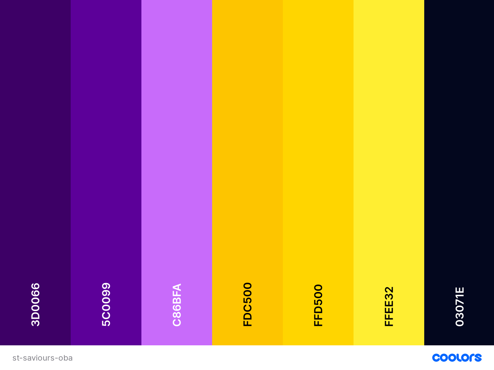
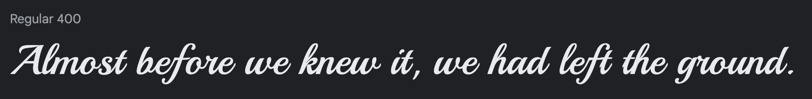
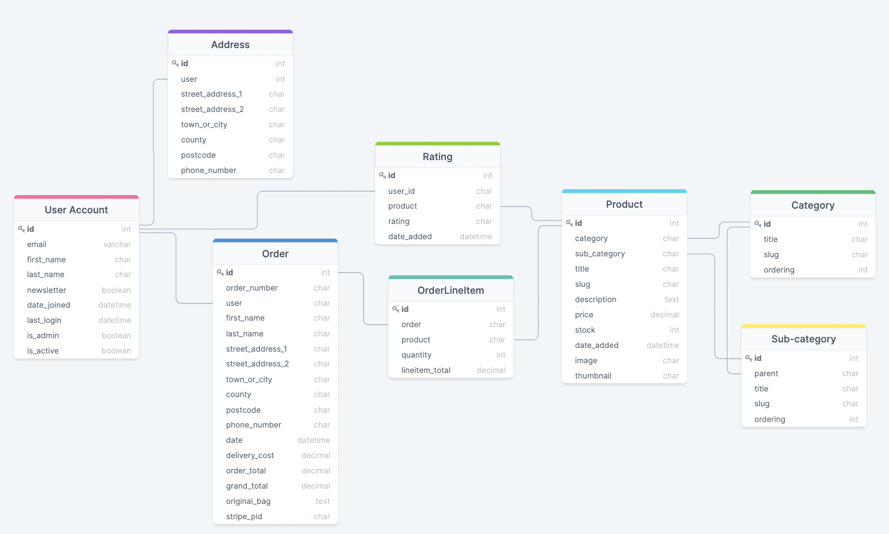

<div align='center'>

</div>

<div align='left'>
<p>The<strong>St Saviours Olympic Boxing Academy</strong> e-commerce store was designed, built and deployed by club member David Burns. The store will help modernise this innercity Dublin boxing club. Prospective members will be able to pay for existing membership bundles online, and existing members can renew easily. Also providing a store for all who want to purchase boxing gear from the club.</p>

**This project contains real images from this real life Dublin boxing club, of which the developer is a member.**

[View the live project here](https://saviours-oba.herokuapp.com/ "Link to St Saviours OBA ecommerce app")

Purchases can be made with the Stripe test credit card:
* **credit card:** 
* **expiration date:** Any future date
* **CVC:** Any 3-digit number
* **ZIP:** Any 5-digit number

<hr>
</div>

### Table of contents
1. [UX](#UX)
     1. [Project Goals](#Project-Goals)
     2. [User Stories](#User-Stories)
     3. [Development Planes](#Development-Planes)
2. [Information Architecture](#Information-Architecture)
     1. [Database](#Database)
     2. [Data Models](#Data-Models)
3. [Features](#Features)
     1. [Design Features](#Design-Features) 
     2. [Existing Features](#Existing-Features)
     3. [Features to Implement in the future](#Features-to-Implement-in-the-future)
4. [Issues and Bugs](#Issues-and-Bugs)
5. [Technologies Used](#Technologies-Used)
6. [Testing](#Testing) ☞ **[Testing.md](TESTING.md)**
7. [Deployment](#Deployment)
8. [Credits](#Credits)
9. [Acknowledgements](#Acknowledgements)
***

<div align='center'>

</div>

***

## UX 
### Project Goals

#### User Goals
The User is looking to:
- Securely purchase or renew membership
- Securely purchase boxing gear
- Securely purchase club apparel
- Contact St Saviours OBA with further questions
- Learn more about the club
- Navigate through the web app with maximum ease

#### Developer / Site Owner Goals
The Developer / Site Owners are looking to:
- Provide a modern, streamlined way  of paying for membership and apparel.
- Reach a wider audience of prospective members through online intergration.
- Showcase the flexible variety of membership payments options.
- Showcase the available boxing gear that can be bought direct from the club.
- Showcase the available apparel that can be bought direct from the club.

### User Stories

* As a new visitor, I want to:

    + Land on an engaging page, with very relevant calls to action
    + See all offers and content without first registering.
    + Register my details when ordering, securely and quickly
    + See contact info for the club, to communicate with staff team.
    + Navigate to a page that could help me with any enquiry, to answer my questions.

* As a returning visitor, I want to:

    + Easily log into my existing account.
    + View my previous orders, to keep a record of my transactions.
    + Check out quickly using my saved details.
    + Edit my info, to update fields ahead of next order.
    + Connect with the club on one of their social apps, to integrate further.

* All users would like to:
    + Choose from a menu of membership options, particular to my own needs.
    + Select apparel in a specific size, to suit my needs.
    + Filter through categories, to only see relevant products.
    + Use a search query, to find a specific product or product type.
    + Add, update and remove items in my shopping bag, during the order process.
    + Receive visual feedback on all of these actions to confirm them.
    + Get real-time feedback on available stock, to make purchase decisions.
    + Proceed to a secure checkout, to make a purchase.
    + Review shopping bag before progressing in checking out process.
    + Have clear visual feedback of the order process, to understand all steps of the process.
    + Be able to edit my bag at all times, to allow change of mind.
    + Receive a summary of my order via email to confirm that my transaction has been process.

* The developer / site owners would like to:
     + Make it easier for the club to sell membership, boxing gear and apparel
     + Ensure the website appears clean, professional and high quality
	+ Ensure the website works on all viewports, so customers can shop from any device
	+ Ensure the payment system is secure and free of errors, such as orders going through without payment or payments being taken multiple times
	+ Provide easy recovery to users who forget their login details
	
### Development Planes

In order to design and create the application, the developer distinguished the required functionality of the site and how it would answer the user stories, as described above, using the **Five Development Planes**:

<strong>1. <u>Strategy</u></strong>

Broken into three categories, the website will focus on the following target audiences:
- **Roles:**
     - Prospective Senior Members/Junior Members
     - Current Senior Members/Junior Members

- **Demographic:**
     - Aged 16+ (to make a purchase)
     - Dublin resident
     - Active/sporty
     - Combat sports orientated

- **Psychographics:**
     - Personality & Attitudes:
          - Sporty
          - Daring
          - Competitive
     - Values:
          - Physical health
          - Goal orientated
          - Community pride

The website needs to enable the **user** to:

- Purchase membership
- Purchase boxing gear and apparel
- Create an account or log in to an existing one
- View past purchases
- Edit/Save their address

- Find out more about the club:
    - Location
    - General questions
    - Points of contact

- Get in contact:
    - Phone
    - Facebook
    - Email(mailto)
    - Contact Form

The website needs to enable the **site owners** to:
- Display all available membership options
- Provide e-shop for boxing gear and apparel
- Provide club information:
    - Location
    - General questions
    - Points of contact

With these goals in mind, a strategy table was created to determine the trade-off between importance and viability with the following results:

<div align='center'>

</div>

<strong>2. <u>Scope</u></strong>

A scope was defined to identify what needed to be done in order to align features with the strategy previously defined. This was broken into two categories:
- **Content Requirements**
     - The user will be looking for:
        - Membership Information:
            - Category
            - Subcategory
            - Image
            - Price
            - Description
            - Age Group
            - Quantity
            - Rating
        - Product Information:
            - Category
            - Subcategory
            - Image
            - Price
            - Description
            - Size
            - Quantity
            - Rating
        - Contact Information:
            - WhatsApp
            - Facebook
            - Email(mailto)
            - Phone Number
            - Contact Form
        - About Section
            - Location
            - FAQ
            - Contact
        - Create/Login to Account
            - Save/update address
            - View Order History
        - Thematic Imagery and Typography
            - Club logo and colours
            - Typography matching club aesthetic

- **Functionality Requirements**
     - The user will be able to:
        - Search Products
            - Membership:
                - By Category, subcategory and title
            - Boxing Gear
                - By Category, subcategory and title
            - Apparel
                - By Category, subcategory and title
        - Make Purchases
        - Sign Up / Login to profile
            - Edit Profile information
            - View Previous orders
            - View shopping bag
        - Interact with shopping bag
            - Add to bag
            - Review bag contents
            - Update bag contents (increase quantity)
            - Remove from bag
        - Read the About Section
        - Find answers to frequent questions

<strong>3. <u>Structure</u></strong>

The website's navigation was organized in order to ensure that users could navigate through the site with ease and efficiency, with the following results: 


<div align='center'align='center'>
<strong>Navigation Structure for User Management:</strong>

</div>

<div align='center'align='center'>
<strong>Navigation Structure for Product Management:</strong>

</div>

<div align='center'align='center'>
<strong>Navigation Structure for Transaction Management:</strong>

</div>

<strong>4. <u>Skeleton</u></strong>

Wireframe mockups were created in a [Figma Workspace](https://www.figma.com/file/h1ntD5dJMvQHQBXjngttOe/St-Saviours-OBA "Link to St Saviours OBA Workspace") with providing a positive user experience in mind:

<strong>5. <u>Surface</u></strong>

- <strong>Colour Scheme</strong>

     - The chosen colour scheme was specifically selected to match our colors at St Saviours OBA. Black and yellow are our primary colours, their clash represents the combatitve nature of the sport.

     - The indigo, purple and heliotrope are used to provide user feedback in relation to the shopping cart feature and payment system.

<div align='center'>

</div>

- <strong>Typography</strong>

     - The primary font for this website is [Oswald](https://fonts.google.com/specimen/Oswald "Link to Oswald Google Fonts page"). It was chosen for its old-school, classic look which fits St Saviours OBA as an old, inner city boxing club.

          

     - The secondary font used is [Playball](https://fonts.google.com/specimen/Playball "Link to Playball Google Fonts page"). It's a similar old-school font with more overt sporty overtones, and works really well for headings and titles.

          


- <strong>Imagery</strong>

     - The imagery used on this web app was purchased from [Canva](https://canva.com/ "Link to Canva") by the developer using a Canva Pro License, or provided to the developer by St Saviours OBA eg. the logo below

     

- <strong>Icons</strong>

[Fontawesome](https://fontawesome.com/) is the source of all icons used throughout this web app.

[Back to top ⇧](#table-of-contents)
***

## Information Architecture

### Database
- During development, a single-database was setup using [SQLite](https://www.sqlite.org/index.html "Link to SQLite site") as this is included and did not require any further installation to support.
- Upon deployment, [Heroku Postgres](https://www.heroku.com/postgres "Link to Heroku Postgres site") was used, as this is an add-on service provided by Heroku.

### Data Models
<div align='center'>

</div>

*model diagram created using [DrawSQL](https://drawsql.app/ "DrawSQL page")*

Unless otherwise stated, the default validation settings of `blank=False, null=False` are assumed.

#### User Model

For this app I created a custom User Model following [this guide in the Django documentation](https://docs.djangoproject.com/en/3.1/topics/auth/customizing/#specifying-a-custom-user-model) and [this tutorial by CodingWithMitch](https://www.youtube.com/watch?v=eCeRC7E8Z7Y).

This made it easy to add custom user fields, and have login based on email as opposed to an unneccessary username being used within model

#### Accounts App

##### `Account` model

| **Name**   | **Database Key**   | **Field Type**   | **Type Validation**   |
| ---------- | ------------------ | ---------------- | --------------------- |
| Email | email | EmailField | max_length=60, unique=True |
| First Name | first_name | CharField | max_length=30 |
| Last Name | last_name | CharField | max_length=30 |
| Date Joined | date_joined | DateTimeField | auto_now_add=True |
| Last Login   | last_login | DateTimeField | auto_now_add=True |
| Is Admin | is_admin | BooleanField | default=False |
| Is Active    | is_active        | BooleanField   | default=False              |
| Is Staff     | is_staff         | BooleanField   | default=False              |
| Is Superuser | is_superuser     | BooleanField   | default=False              |

A custom user manager is defined as per [the Django documentation](https://docs.djangoproject.com/en/3.0/topics/auth/customizing/#writing-a-manager-for-a-custom-user-model)

##### `Address` model

| **Name**   | **Database Key**   | **Field Type**   | **Type Validation**   |
| ---------- | ------------------ | ---------------- | --------------------- |
| User | user | OneToOneField 'Account' | on_delete=models.CASCADE |
| Street Address 1 | street_address_1 | CharField | max_length=80 |
| Street Address 2 | street_address_2 | CharField            | max_length=80, null=True, blank=True |
| Town or City     | town_or_city | CharField | max_length=40 |
| County | county | CharField | max_length=40 |
| Country          | country          | CountryField         | default="IE"                         |
| Postcode         | postcode         | CharField            | max_length=20                        |
| Phone Number | phone_number | CharField | max_length=20 |

#### Products App

##### `Category` model

| **Name**   | **Database Key**   | **Field Type**   | **Type Validation**   |
| ---------- | ------------------ | ---------------- | --------------------- |
| Title    | title            | Charfield      | max_length=255                  |
| Slug     | slug             | Charfield      | max_length=255,<br />blank=True |
| Ordering | order            | IntegerField   | default=0                       |

##### `Subcategory` model

| **Name**   | **Database Key**   | **Field Type**   | **Type Validation**   |
| ---------- | ------------------ | ---------------- | --------------------- |
| Parent   | parent           | OneToOneField 'Category' | on_delete=models.CASCADE        |
| Title    | title            | Charfield                | max_length=255                  |
| Slug     | slug             | Charfield                | max_length=255,<br />blank=True |
| Ordering | order            | IntegerField             | default=0                       |

##### `Product` model

| **Name**   | **Database Key**   | **Field Type**   | **Type Validation**   |
| ---------- | ------------------ | ---------------- | --------------------- |
| Category    | category         | OneToOneField 'Category'    | on_delete=models.CASCADE                                  |
| Subcategory | subcategory      | OneToOneField 'Subcategory' | on_delete=models.CASCADE                                  |
| Product Select | product_select | ManyToManyField(ProductOption) | through='ProductSelect',<br /> related_name='product_options',<br /> blank=True |
| Title       | title            | Charfield                   | max_length=255                                            |
| Slug        | slug             | Charfield                   | max_length=255,<br />blank=True                           |
| Description | description      | TextField                   | blank=True, null=True                                     |
| Price       | price            | DecimalField                | max_digits=7,<br />decimal_places=2                       |
| Date Added  | date_added       | DateTimeField               | auto_now_add=True                                         |
| Image       | image            | ImageField                  | upload_to="/products/",<br />blank=True, null=True        |
| Thumbnail   | thumbnail        | ImageField                  | upload_to="/products/thumbnails/", blank=True, null=True  |

##### `ProductSelect` Model

| **Name**      | **Database Key**  | **Field Type** | **Type Validation** |
|--------------|--------------|--------------|--------------|
| Selected Product Option | product_select | ForeignKey(ProductOption) | on_delete=models.CASCADE |
| Selected Product | product | ForeignKey(Product) | on_delete=models.CASCADE,<br /> related_name='product_options' |
| Stock Count | stock_count | IntegerField | default=30|


##### `Rating` model

| **Name**   | **Database Key**   | **Field Type**   | **Type Validation**   |
| ---------- | ------------------ | ---------------- | --------------------- |
| User ID | user_id | OneToOneField 'Account' | on_delete=models.CASCADE |
| Product | product | OneToOneField 'Product' | on_delete=models.CASCADE |
| Rating | rating | IntegerField | choices=Stars.choices |
| Date Added | date_added | DateTimeField | auto_now_add=True |

#### Checkout App

##### `Order` model

| **Name**   | **Database Key**   | **Field Type**   | **Type Validation**   |
| ---------- | ------------------ | ---------------- | --------------------- |
| Order Number | order_number | CharField | max_length=32,<br />editable=False,<br />unique=True |
| User | user | ForeignKey 'Account' | on_delete=models.SET_NULL,<br />null=True, <br />blank=True,<br />related_name='orders' |
| First Name | first_name | CharField | max_length=50 |
| Last Name | last_name | CharField | max_length=50 |
| Street Address 1 | street_address_1 | CharField | max_length=80 |
| Street Address 2 | street_address_2 | CharField | max_length=80,<br />null=True, blank=True |
| Town or City | town_or_city | CharField | max_length=40 |
| County | county | CharField | max_length=40 |
| Postcode | postcode | CharField | max_length=20 |
| Phone Number | phone_number | CharField | max_length=20 |
| Date | date | DateTimeField | auto_now_add=True |
| Delivery Cost | delivery_cost | DecimalField | max_digits=8,<br />decimal_places=2, default=0 |
| Order Total | order_total | DecimalField | max_digits=12, <br />ecimal_places=2, default=0 |
| Grand Total | grand_total | DecimalField | max_digits=12,<br />decimal_places=2, default=0 |
| Original Cart | original_cart | TextField |  |
| Stripe PID | stripe_pid | CharField | max_length=254 |

##### `OrderLineItem` model

| **Name**        | **Database Key** | **Field Type**       | **Type Validation**                                       |
| --------------- | ---------------- | -------------------- | --------------------------------------------------------- |
| Order           | order            | ForeignKey 'Order'   | on_delete=models.CASCADE,<br />related_name='lineitems'   |
| Product         | product          | ForeignKey 'Product' | on_delete=models.CASCADE                                  |
| Quantity        | quantity         | IntegerField         | default=0                                                 |
| Line Item Total | lineitem_total   | DecimalField         | max_digits=12,<br />decimal_places=2,<br />editable=False |

## Features

### Design Features
Each page of the St Saviours OBA website features a consistently responsive and intuitive naviational system:

#### Navbar
- Users will find a **navbar** conventionally placed on the top of each page. Navigational links are identifiable and accessible, and the club logo redirects users to the home page.
- The navbar utilises **dropdown** menus for cleaner design.
- If the user is in session, an additional dropdown menu provides users with account functionality.
- On mobile and tablet devices, the navigation menu collapses into a **hamburger** menu on top left for a cleaner design.
- The shopping bag icon to top right is designed quick and convenient access to items selected for secure checked out.
- **Toasts** are displayed under the navbar, providing users with realtime feedback on their actions.

#### Footer
- The **footer** contains links for users to navigate to their preferred location with ease.
- The links are divided into appropriate categories, allowing users to choose precisely where they'd like to visit, and displaying the extent of options available to them.
- These links are displayed in four columns on large and medium devices, and single columns on small.
- The footer also provides the Club **social links** and **copyright** information.
     - Link to Club Facebook, Instagram and Tiktok.
     - Mailto link to club emails

#### Page Layout

- A banner title is provided on each page to help users to quickly determine their location
- [Jinja](https://jinja.palletsprojects.com/en/3.0.x/ "Link to Jinja docs") was used to extend the base.html page, allowing for the utmost consistency and preservation of functionality across all pages. The extended block elements created the same basic layout for each page:

     ```
     <nav>
          <!-- Navigational content -->
     </nav>

     
          <!-- Appropriate toast messages -->
     

     
          <!-- Content unique to each page -->
     

     <footer>
          <!-- Footer content -->
     </footer>
     ```

### Existing Features 

#### **General Pages:**

**[Store Home Page](https://saviours-oba.herokuapp.com/ "Link to Home page")**
| Feature      | Description  |
|:--------------:|--------------|
|  Hero Image  | The hero image depicts an empty boxing cornerstool, metonymically calling the user to take on the challenge of becoming a boxing hero   |
| Dual Links | Links to the all options for membership and all products for boxing gear are displayed to quickly capitalise on the most profitable reasons for a users' visit. |
| Category cards | Thumbnail images with buttons act as user links to different shop categories for visitors. Both images and buttons redirect users to their respective categories. |


**[Membership Page](https://saviours-oba.herokuapp.com/shop/membership/ "Link to Membership page") & [Boxing Gear Page](https://saviours-oba.herokuapp.com/shop/boxing-gear/ "Link to Boxing Gear page") & [Apparel Page](https://saviours-oba.herokuapp.com/shop/apparel/ "Link to Apparel page")**

| Feature      | Description  |
|:--------------:|--------------|
| Breadcrumbs | Allows users to return to the **Home** page. |
| Sort Products Button | Products can be quickly sorted by price or date|
| Search Bar | Using icon in nav, users can search products with a text search relating to product category, subcategory, title |
| Product Cards | The product cards provide users with a link from the product image and name to the product details page. |
| Pagination | Pagination displays 8 products per page, avoiding unneccary scrolling. |

**[Search Page](https://saviours-oba.herokuapp.com/search"Link to Search page")**

| Feature      | Description  |
|:--------------:|--------------|
| Input field | Allowing users to enter their search query, with an appended search button. |
| Category Cards | Category cards provide users with a convenient quick-link to the categories, in lieu of searching for something. Both images and buttons redirect users to their respective categories. |
| Dynamic feedback | When a user enters a term, there is dynamic text that displays the number of results returned and their search term. If there are no results, conditional text explains this to the user. |
| Reset Link | Clicking the **Search title** will reset the search bar.|

**[Individual Product Page](https://saviours-oba.herokuapp.com/shop/membership/yearly-bundle/yearly-bundle-gold "Link to Example Product page")**
| Feature      | Description  |
|:--------------:|--------------|
| Breadcrumbs | Allows users to return the category page for that product (Apparel or Courses) or **Home** page. |
| Dropdown Select Menu | Allows users to refine their product selection e.g. sizes. Information is provided for stock availabilty for all product selections.|
|Quantity | An input with appending and prepending buttons allows users to alter their quantity selection. This feature is dynamically designed to become inactive at the product's stock availabilty, or if the product is a membership bundle. |
| Back Button | Returns users back to the shop page, for convenience.|
| Add to Bag button | Allows users to add the product to their shopping bag |
| Submit Rating button | Allows users to add a rating to the product |

**[Login Page](https://saviours-oba.herokuapp.com/accounts/login/ "Link to Login page")**
| Feature      | Description  |
|:--------------:|--------------|
| Input fields | Allows users to enter their username, or email, and password |
| Reset Password link | Redirecting users to reset their password **(custom built functionality)** |
| Register button | call-to-action button directing users to signup page |

**[Register Page](https://saviours-oba.herokuapp.com/accounts/register/ "Link to Register page")**
| Feature      | Description  |
|:--------------:|--------------|
| Input fields |  Allows users to enter their information to register an account |
| Register button | Allows users to create their account **(custom built functionality)**|

**[The Club Page](https://saviours-oba.herokuapp.com/about/ "Link to the Club page")**
| Feature      | Description  |
|:--------------:|--------------|
| Embeded Google Maps | A Google maps embed was used to provide users with an interactive map, with the pin dropped on the club location. ([Map reference](https://www.embedgooglemap.net/ "Link to Google Maps Embedding page")) |
| Phone Link | An anchor link was used for the Membership Officers phone number to provide a convenient quick-link. |
| Mailto action | Three emails are provided using the club email address, with the difference in the subject line to highlight the message for the appropriate officer (for convienience) in order to help the user to send the message quicker. |

**[Club FAQs](https://saviours-oba.herokuapp.com/faqs/ "Link to FAQs Programme page")**
| Feature      | Description  |
|:--------------:|--------------|
| Accordion | An accordion is used for each individual class, with the class name and age range displayed. Clicking the level opens the card and displays information pertaining to that level. |
| Hide/Show Buttons | A `Hide All` and `Show All` button are used to provide users with the capacity to open all cards or close all cards, for convienience. |

**[Contact Us Page](https://saviours-oba.herokuapp.com/contact/ "Link to Contact page")**
| Feature      | Description  |
|:--------------:|--------------|
| Contact Form | Used for users to conveniently send a message to our Club Admin without having to open their email app.|

#### **Authorised User Pages:**

**Shopping Bag Page**
| Feature      | Description  |
|:--------------:|--------------|
| Breadcrumbs | Page breadcrumbs allow users to backtrack to the **Home** page |
| Duel Links | Links are displayed when user's **shopping bag is empty** to provide quick-link access to product categories. Both images and buttons redirect users to their respective categories. |
| Keep Shopping button | Link redirects users to the **All Products** page. Available when at all stages (when bag is both empty and containing items.|
| Remove button | Placed at the top right of each product, allowing users to quickly **remove** the product from the shopping bag. |
|Quantity | An input with appending and prepending buttons allows users to **alter their quantity selection**. This feature is dynamically designed to become inactive if the quantity count is 1 or at the product's stock availabilty. |
| Update button | Updates the bag with the users inputed quantity. |
| Checkout button | Directs users to the **first** page of the checkout process.|

**Order Review Page**
| Feature      | Description  |
|:--------------:|--------------|
| No navbar or footer | This conventionally removed, to minimalist checkout interface , preventing users from breaking the checkout process. ([Source](https://www.smashingmagazine.com/2009/05/12-tips-for-designing-an-excellent-checkout-process/#8-keep-the-checkout-interface-simple "Link to Smashing Magazine")) |
| Logo Link | Logo at the top of the page **redirects users to the shopping bag** for convienience |
| Heads-up display | This shows the users the steps in the checkout process, giving them **feedback on where they are** and where they are going. |
| Return buttton | Redirects users back to their shopping bag for **editing**. |
| Checkout button | Directs users to the next page of the checkout process.| 

**Order Details Page**
| Feature      | Description  |
|:--------------:|--------------|
| No navbar or footer | This conventionally removed, to minimalist checkout interface , preventing users from breaking the checkout process. ([Source](https://www.smashingmagazine.com/2009/05/12-tips-for-designing-an-excellent-checkout-process/#8-keep-the-checkout-interface-simple "Link to Smashing Magazine")) |
| Heads-up display | This shows the users the steps in the checkout process, giving them feedback on where they are and where they are going. Clicking the first number will return them to **to the previous page** |
| Input fields | Allowing users **enter their delivery information** |
| Checkbox button | Allowing users to chose to **save their information** to their profile |
| Order Summary | Providing clear **feedback on bag contents**. On large screens, this is displayed on the right side of the screen. On mobile and tablet devices, this is displayed in a collapsable menu |
| Edit buttton | Redirects users back to their shopping bag for **editing**. |
| Complete Order button | Completes the checkout process.| 

**Order Complete Page**
| Feature      | Description  |
|:--------------:|--------------|
| Product Buttons | Products ordered are displayed in a table (along with other order information, such as price and quantity) and act as buttons to the product detail page, for convienience. |


**User Accounts Page**
| Feature      | Description  |
|:--------------:|--------------|
| Call to action Buttons | Displayed on the left side of the screen on larger devices and at the end of the page on mobile and tablet devices. Provide users with actions to take on their account, such as change password or emails, as well as logout and redirection to **Order History** page.|
| Quick Links | Allows users to add, edit or remove their account details.|

**Order History Page**
| Feature      | Description  |
|:--------------:|--------------|
| Call to action Buttons | Displayed on the left side of the screen on larger devices and at the end of the page on mobile and tablet devices. Provide users with actions to take on their account, such as change password or emails, as well as logout and redirection to **Profile** page.|
| Call to action buttons | User's order history is displayed on the right side of the screen on larger devices and at the top (single column) on smaller screens. It provides a snapshop of order information, including date of purchase, number of items, order total. |

## Technologies Used
### Languages
- [HTML5](https://en.wikipedia.org/wiki/HTML5 "Link to HTML Wiki")
- [CSS3](https://en.wikipedia.org/wiki/Cascading_Style_Sheets "Link to CSS Wiki")
- [JavaScript](https://en.wikipedia.org/wiki/JavaScript "Link to JavaScript Wiki")
- [Python](https://www.python.org/ "Link to Python Homepage")

### Tools
- [Git](https://git-scm.com/ "Link to Git homepage")
     - Git was used for version control to commit to Git and push to Heroku.
- [GitHub](https://github.com/ "Link to GitHub")
     - GitHub was used to store the project repository, after pushing.
- [Heroku](https://id.heroku.com/login "Link to Heroku login page")
     -  Heroku was used in order to deploy the website.
- [Django](https://www.djangoproject.com/ "Link to Django Homepage")
     - Django was used as the web framework for the application.
- [AWS](https://aws.amazon.com/ "Link to AWS Homepage")
     - The Amazon Web Service **s3 Bucket** was used to store static and media files in the production database.
- [Stripe](https://stripe.com/en-ie "Link to Stripe Homepage")
     - Stripe was used to handle user payments on the webshop.
- [Figma](https://www.figma.com/ "Link to Figma homepage")
     - Figma was used to create the wireframes during the design phase of the project.
- [Am I Responsive?](http://ami.responsivedesign.is/# "Link to Am I Responsive Homepage")
     - Am I Responsive was used in order to validate the responsiveness of the design throughout the process, and to generate mockup imagery to be used.
- [Procreate](https://procreate.art/ "Link to ProCreate homepage")
     - Procreate was used to create and edit images as well as using the colour picker tool to ensure consistency throughout.
- [Font Awesome](https://fontawesome.com/ "Link to Font Awesome site")
     - Font Awesome was used in conjunction with Iconify for icons used throughout the website.

### Libraries
- [Bootstrap](https://getbootstrap.com/docs/4.4/getting-started/introduction/ "Link to Bootstrap page")
     - Bootstrap was used to implement the responsiveness of the site, using bootstrap classes.
- [jQuery](https://jquery.com/ "Link to jQuery page")
     - jQuery was used to simplify the JavaScript code used.
- [Google Fonts](https://fonts.google.com/ "Link to Google Fonts")
    - Google fonts was used to import the fonts **"Indie Flower"** and **"Work Sans"** into the style.css file. These fonts were used throughout the project.
- [jQuery Validation](https://jqueryvalidation.org/ "Link to jQuery Validation page")
     - jQuery Validation was used to simplify form validation for the **Contact Form**.
- [SweetAlert2](https://sweetalert2.github.io/ "Link to Sweet Alert 2 page")
     - SweetAlert2 was used to customise the **Contact Form** success message for UX 
- [Jinja](http://jinja.pocoo.org/docs/2.10/ "Link to Jinja information")
     - Jinja templating language was used to simplify and display backend data in html.

### Database Management
- [SQLite](https://www.sqlite.org/index.html "Link to SQLite site")
     - SQLite was used as a single-file database during development.
- [Heroku Postgres](https://www.heroku.com/postgres "Link to Heroku Postgres site")
     - Heroku Postgres was used for production database, provided by Heroku.

### Main Packages
- [Django AllAuth](https://django-allauth.readthedocs.io/en/latest/index.html "Link to allauth docs")
     - AllAuth was the primary method for user authentication, registration and account management.
- [Django Crispy Forms](https://django-crispy-forms.readthedocs.io/en/latest/ "Link to Crispy Forms Doc")
     - Crispy Forms was used to style Django Forms.
- [Pillow](https://pillow.readthedocs.io/en/stable/ "Link to Pillow Doc")
     - Pillow was used to aid in image processing on the database.
- [Django Countries](https://pypi.org/project/django-countries/ "Link to Django Countries doc")
     - Django countries was used to ensure correct country codes were used in user forms.


[Back to top ⇧](#table-of-contents)
***

## Testing

Testing information can be found in a separate testing [file](TESTING.md "Link to testing file")

***

## Deployment

To further develop this project, a clone can be made using the following steps:

*Deployment Instructions assume you are working on a MacOS and may differ on other operating systems. Please check documentation specific for your operating system*

### Prerequisites
To run the project on your own IDE, ensure you have the following:

- An IDE (such as [Visual Studio Code](https://code.visualstudio.com/) or [GitPod](https://www.gitpod.io/))
- [Python](https://www.python.org/downloads/) (*this project uses version 3.6*)
- [PIP](https://pypi.org/project/pip/) for package installation
- [Git](https://git-scm.com/downloads) for project version control
- [AWS](https://aws.amazon.com/) account with a set up [S3 Bucket](https://docs.aws.amazon.com/AmazonS3/latest/gsg/CreatingABucket.html)

- [Stripe](https://dashboard.stripe.com/register) Account for payment functionality

How to run this project within a local IDE, such as VSCode:

1. Log into [GitHub](https://github.com/login "Link to GitHub login page") or [create an account](https://github.com/join "Link to GitHub create account page").
2. Locate the [GitHub Repository](https://github.com/rebeccatraceyt/bake-it-til-you-make-it "Link to GitHub Repo").
3. Under the repository name, click "Clone or download".
4. In the Clone with HTTPs section, copy the clone URL for the repository.
5. In your local IDE open the terminal.
6. Change the current working directory to the location where you want the cloned directory to be made.
7. Type 'git clone', and then paste the URL you copied in Step 3.
     ```
     git clone https://github.com/USERNAME/REPOSITORY
     ```
8. Press Enter. Your local clone will be created.


### Local Deployment

Once a local clone is created, follow the below steps to deploy locally:
1. Install all project requirments using the below command in the CLI terminal:
     ```
     pip3 install -r requirements.txt
     ```
2. Create a `.gitignore` file in the project's root directory.
3. Create an `env.py` file in the root directory.
4. Add `env.py` to the `.gitignore` file.
5. Within the `env.py` file, enter the project's environment variables:
     ```
     import os

     os.environ.setdefault("SECRET_KEY", <your_secret_key>)
     os.environ.setdefault("DEVELOPMENT", '1')
     os.environ.setdefault("STRIPE_PUBLIC_KEY", <your_key>)
     os.environ.setdefault("STRIPE_SECRET_KEY", <your_key>)
     os.environ.setdefault("STRIPE_WH_SECRET", <your_key>)
     ```
     - A secret key can be generated using [Django Secret Key Generator](https://miniwebtool.com/django-secret-key-generator/)*

     - Stripe Public and Secret keys can be generated after Stripe account signup. Keys are found in 'Developers' Section, under 'API Keys'

     - Webhook key (WH) can be generated under 'Developers' section of your stripe Dashboard. Select 'Add endpoint' and enter:*

     ```
     https://<yourhosturl>/checkout/wh/
     ```

     - Select 'Receive All Events' and 'Add Endpoint' and view your 'signing secret' 

6. Migrations will need to be made to create the local database and can be done using the following commands in the CLI terminal:
     ```
     python3 manage.py makemigrations
     ```
     ```
     python3 manage.py migrate
     ```
7. Next, you will need to import the db.json file found in the `Pages` and `Shop` apps. The `JSON` file contains all data needed to host the database and can be imported using the following commands in the CLI terminal:
     ```
     python3 manage.py loaddata db.json     
     ```

8. A `superuser` will needed to be created to gain access to the Django Admin Page and can be created using the following commands in the CLI terminal:
     ```
     python3 manage.py createsuperuser
     ```
9. Launch the project server using the below command in the CLI terminal:
     ```
     python3 manage.py runserver
     ```
10. A server should be running locally on http://127.0.0.1:8000/. In running the server, a new SQLite3 database file (`db.sqlite3`) will be created in the root directory.

*Once this is complete, the project should run within your local development environment.*

### Heroku App Creation
The website requires back-end technology, including a server, application and database. It is because of this that the project was deployed on **Heroku**, a container-based cloud Platform as a Service. There are two ways to deploy on Heroku:

- Using the Heroku Command Line Interface
- Connect to GitHub Repository (the developer recommends this method)

**Create Heroku App**
1. Log into [Heroku](https://id.heroku.com/login "Link to Heroku login page") or [create an account](https://signup.heroku.com/login "Link to Heroku sign-up page").
2. Select the `New` button on the top-right of the page, and choose `Create New App`. Give your app a unique name (something that is the same, or similar to, your Django App) and set the region (in this instance: **Europe**). Then click `Create App`.
3. Navigate to the `Deploy` tab on the dashboard and select `Connect to GitHub`.
4. Search for the repository name (ensuring it is spelled correctly). Once located, click `Connect`. 

**Create PostgreSQL Database**
1. On the Heroku dashboard, navigate to `Resources` section.
2. In the search bar, enter `postgres` and select `Heroku Postgres`.
3. For this project, the plan name os `Hobby Dev - Free`, but feel free to select your own.
4. Once a plan is selected, `Submit Order Form`.

**Configure Heroku Variables**
1. On the Heroku dashboard, navigate to `Settings` and locate `Reveal Config Vars` button to set the following necessary variables for the project (Note: You may not have all variable values yet, add the ones that you have available and add the others in due course):

     | Key      | Value  |
     |--------------|--------------|
     | AWS_ACCESS_KEY_ID | `Your AWS Access Key` |
     | AWS_SECRET_ACCESS_KEY | `Your AWS Secret Access Key` |
     | DATABASE_URL | `Your Database URL` |
     | EMAIL_PASS | `Your Email Password` |
     | EMAIL_USER | `Your Email Address`|
     | SECRET_KEY | `Your Secret Key` |
     | STRIPE_PUBLIC_KEY | `Your Stripe Public Key` |
     | STRIPE_SECRET_KEY | `Your Stripe Secret Key` |
     | STRIPE_WH_SECRET | `Your Stripe WH Key` |
     | USE_AWS | `TRUE` |
     ***Ensure all values are the same as the values set in your `env.py` file***

2. Navigate back to the `Deploy` tab and scroll down to `Automatic Deploys`.
3. Ensure that the `master` branch is selected, then select `Enable Automatic Deploys`.

**Configure PostgreSQL Database**
1. In the project CLI, install the following dependancies to use Postgres:
     ```
     pip3 install dj_database_url
     ```
     ```
     pip3 install psycopg2_binary
     ```
     ```
     pip3 install gunicorn
     ```
2. Freeze new dependancies using `$ pip3 freeze > requirements.txt`
3. Create a `Procfile` file so that Heroku knows which file runs the app. In the terminal window, type the following command:
     ```
     $ echo web: python app.py > Procfile
     ```
     *Remove the blank line that may occur at the end of the Procfile to avoid any issues*
4. Push the two files to the repository:
     ```
     $ git add .
     $ git commit -m "Commit Message"
     $ git push
     ```
5. In the project's `settings.py` file:
     - Add `import dj_database_url` to imports section (top)
     - Locate `DATABASES` constant variable within the file and replace it with the following:
          ```
          if "DATABASE_URL" in os.environ:
               DATABASES = {"default": dj_database_url.parse(os.environ ["DATABASE_URL"])}
          else:
               DATABASES = {
               "default": {
                    "ENGINE": "django.db.backends.sqlite3",
                    "NAME": BASE_DIR / "db.sqlite3",
               }
          }

          ```
6. Backup current SQLite database by entering the following into the CLI:
     ```
     ./manage.py dumpdata --exclude auth.permission --exclude contenttypes > db.json
     ```
7. Login into your Heroku CLI using: 
     ```
     heroku login -i
     ```
8. Migrate models to the new Postgres database:
     ```
     python manage.py makemigrations
     ```
     ```
     python manage.py migrate
     ```
9. A new `superuser` will needed to be created to gain access to the Django Admin Page and can be created using the following commands in the CLI terminal:
     ```
     python3 manage.py createsuperuser
     ```
10. Reload the data into the new database using the folowing:
     ```
     ./manage.py loaddata db.json
     ```
11. Temporarily disable `COLLECTSTATIC` to prevent Heroku from collecting static files until they have been set up on AWS:
     ```
     heroku config:set DISABLE_COLLECTSTATIC=1 --app <your app name>
     ```
     *`--app` command is necessary if you have more than one heroku apps*
12. Add Heroku to the `ALLOWED HOSTS` varible in `settings.py`: 
     ```
     ALLOWED_HOSTS = ['127.0.0.1',
                      '<your app name>.herokuapp.com',
                      'localhost']
     ```
13. Push these changes to Github:
     ```
     $ git add .
     $ git commit -m "Commit Message"
     $ git push
     ```
14. Set up push to Heroku:
     ```
     heroku git:remote -a <your app name>
     ```
15. Push to Heroku:
     ```
     git push heroku main
     ```

Heroku will receive the pushed code from the GitHub repository and host the application with the required packages set out. 

The deployed version can now be viewed by selecting `View App` in the top-right of the page.

### AWS S3 Bucket Creation
All Static and Media files in the production version of this site are hosted on an [Amazon Web Services](https://aws.amazon.com/ "Link to Amazon Web Services")(AWS) S3 Bucket. 

To create your own bucket,
1. Log into [Amazon AWS](https://signin.aws.amazon.com/signin?redirect_uri=https%3A%2F%2Fconsole.aws.amazon.com%2Fconsole%2Fhome%3Ffromtb%3Dtrue%26hashArgs%3D%2523%26isauthcode%3Dtrue%26state%3DhashArgsFromTB_us-east-1_5214b8df504a8629&client_id=arn%3Aaws%3Asignin%3A%3A%3Aconsole%2Fcanvas&forceMobileApp=0&code_challenge=VZ2MXWWFffZ9ITDaY-O8yEnyikt3FflPh7PpibLEGRk&code_challenge_method=SHA-256 "Link to Amazon AWS login page") or [create an account](https://portal.aws.amazon.com/billing/signup?refid=em_127222&redirect_url=https%3A%2F%2Faws.amazon.com%2Fregistration-confirmation#/start "Link to Amazon AWS sign-up page").

**Create AWS S3 Bucket**
1. Navigate to the [S3 Bucket](https://aws.amazon.com/s3/ "Link to S3 Bucket page") and create a unique bucket for your application using the `Create Bucket` button:
     - Give your bucket a name (same or similar to Django and Heroku app names)
     - Select the region closest to you
     - Uncheck Block Public Access and tick to acknowledge that the bucket will be public
     - Click `Create Bucket`
2. On your Bucket Dashboard, locate the `Properities` section and configure the following:
     - `Turn on Static Web Hosting`
     - In index and errror, enter `index.html` and `error.html`
     - Click `Save`
3. On your Bucket Dashboard, locate the `Permissions` section and configure the following:
     - In `CORS`:
     ```
     [
          {
               "AllowedHeaders": [
                    "Authorization"
               ],
               "AllowedMethods": [
                    "GET"
               ],
               "AllowedOrigins": [
                    "*"
               ],
               "ExposeHeaders": []
          }
     ]

     ```
     - In `Bucket Policy`, click `Generate Policy` and follow the below steps:
          - Click `Policy` > `S3 Bucket Policy`
          - Add `*` to the `Principal Field` (selects all principals)
          - Set `Action` to `Get Object`
          - Paste in `ARN` from previous page
          - Click `Add Statement`
          - Click `Generate Policy`
          - Copy and paste new policy into `Bucket Policy`
          - Add `*/` to the end of the `Resources Key`
          - Click `Save`
     - In `Access Control List` set the `List Objects Permission` to `everyone`
4. Access `IAM` Dashboard from `Sevices` dropdown list
     - Create an new user group
     - Create a policy from the `Policy` tab
          - Select `Import Managed Policy`
          - Select `S3 Full Access Policy`
     - To override any existing content, in the `Resource` section, paste the following:
          ```
          [
               arn:aws:s3:::<your-bucket-name>",
               "arn:aws:s3:::<your-bucket-name>/*"
          ]
          ```
     - Continue to `Create Policy`
     - Attach new policy to the user group by locating the group and selecting `Attach Policy` next to your new policy.
     - Navigate to `Users` tab and select `Add User` Create a name and ensure it has `Programmatic access`. Add new user to the group.
     - Once the user is added, a `.csv` file will be provided.
          - **Download this file and save these variables**
          - Add variables to your Heroku Config Variables.
5. Navigate to your Bucket and manually input all files in the `media` folder.
For further information on creating a bucket, head to the [AWS Instructions](https://docs.aws.amazon.com/AmazonS3/latest/userguide/creating-bucket.html "Create a bucket tutorial") page

**Configure Bucket**
1. In the project CLI, install the following dependancies to use AWS:
     ```
     pip3 install boto3
     ```
     ```
     pip3 install django-storages
     ```
2. Freeze new dependancies using `$ pip3 freeze > requirements.txt`
3. In the project's `settings.py` file, add `storages` to INSTALLED_APPS variable.
4. In order to link your new AWS Bucket to your project, paste:
     ```
     if 'USE_AWS' in os.environ:
          # Cache control
          AWS_S3_OBJECT_PARAMETERS = {
               'Expires': 'Thu, 31 Dec 2099 20:00:00 GMT',
               'CacheControl': 'max-age=94608000',
          }

          # Bucket Config
          AWS_STORAGE_BUCKET_NAME = 'your_bucket_name'
          AWS_S3_REGION_NAME = 'your_region'
          AWS_ACCESS_KEY_ID = os.environ.get('AWS_ACCESS_KEY_ID')
          AWS_SECRET_ACCESS_KEY = os.environ.get('AWS_SECRET_ACCESS_KEY')
          AWS_S3_CUSTOM_DOMAIN = f'{AWS_STORAGE_BUCKET_NAME}.s3.amazonaws.com'

          # Static and media files
          STATICFILES_STORAGE = 'custom_storages.StaticStorage'
          STATICFILES_LOCATION = 'static'
          DEFAULT_FILE_STORAGE = 'custom_storages.MediaStorage'
          MEDIAFILES_LOCATION = 'media'

          # Override static and media URLs in production
          STATIC_URL = f'https://{AWS_S3_CUSTOM_DOMAIN}/{STATICFILES_LOCATION}/'
          MEDIA_URL = f'https://{AWS_S3_CUSTOM_DOMAIN}/{MEDIAFILES_LOCATION}/'
     ```
5. Create a `custom_storages.py` file in your project's root directory. Inside it, include the Static and Media Storage locations:
     ```
     from django.conf import settings
     from storages.backends.s3boto3 import S3Boto3Storage

     class StaticStorage(S3Boto3Storage):
     location = settings.STATICFILES_LOCATION

     class MediaStorage(S3Boto3Storage):
     location = settings.MEDIAFILES_LOCATION
     ```
6. Delete `DISABLE_COLLECTSTATIC` variable from your Heroku Config Variables
7. Push these changes to Github:
     ```
     $ git add .
     $ git commit -m "Commit Message"
     $ git push
     ```

<div align='center'>
<h2><span style='font-size:20px;'>&#127882;</span> Congrats! <span style='font-size:20px;'>&#127882;</span> </h2>
<h4>Your project is ready to use. Have fun!</h4>
</div>

[Back to top ⇧](#table-of-contents)
***

## Credits 
The developer consulted multiple sites and multiple other Code Institute students in order to better understand the code they needed to implement their application. 

The [Code Institute Boutique Ado Mini Project](https://github.com/Code-Institute-Solutions/boutique_ado_v1) was used as a reference point for the developer in the development of the core functionality of the website. The lessons included with the mini-project helped the developer to get a better understanding of each functionality and how to customise it to suit their project.

Code Institute students Rebecca Tracey and Ciaran Concannon's final projects
- [Delphin Lifesaving Club](https://github.com/rebeccatraceyt/delphin_lifesavingclub/ "Delphin Lifesaving Club")
- [Rhythm Box](https://github.com/cjcon90/the_rhythm_box "Delphin Lifesaving Club")

For code that was copied and edited, the developer made sure to reference this within the code. The following sites were used on a more regular basis:
- [Coding with Mitch](https://www.youtube.com/watch?v=eCeRC7E8Z7Y "Coding with Mitch Tutorials")
- [Bootstrap](https://getbootstrap.com/ "Link to BootStrap page")
- [Stack Overflow](https://stackoverflow.com/ "Link to Stack Overflow page")

[Back to top ⇧](#table-of-contents)
***

## Acknowledgements
The developer would like to thank the following:
- The Code Institute student community for the support and inspiration they gave.
- Their mentor Marcel for his guidance and his patience.

[Back to top ⇧](#table-of-contents)

***