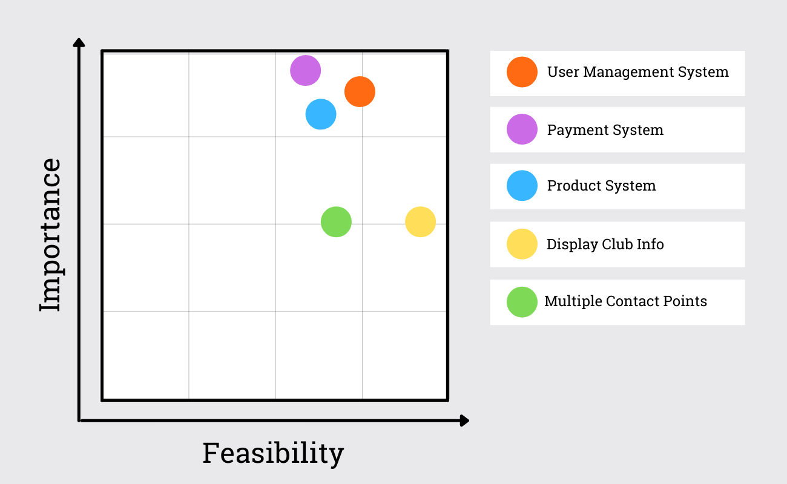
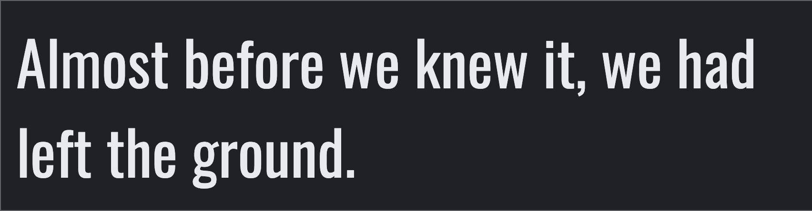

<div align='center'>

</div>

<div align='left'>
<p>The<strong>St Saviours Olympic Boxing Academy</strong> e-shop was designed, built and deployed by club member David Burns. The purpose of this web application is to modernise this innercity boxing club. Prospective members will be able to subscribe online, and existing members can renew easily. Also providing a store for all who want to purchase boxing gear from the club.</p>

**This project contains real images from this real life Dublin boxing club, of which the developer is a member.**

[View the live project here](# "Link to St Saviours OBA ecommerce app")

Purchases can be made with the Stripe test credit card:
* **credit card:** 
* **expiration date:** Any future date
* **CVC:** Any 3-digit number
* **ZIP:** Any 5-digit number

<hr>
</div>

### Table of contents
1. [UX](#UX)
     1. [Project Goals](#Project-Goals)
     2. [User Stories](#User-Stories)
     3. [Development Planes](#Development-Planes)
2. [Information Architecture](#Information-Architecture)
     1. [Database](#Database)
     2. [Data Models](#Data-Models)
3. [Features](#Features)
     1. [Design Features](#Design-Features) 
     2. [Existing Features](#Existing-Features)
     3. [Features to Implement in the future](#Features-to-Implement-in-the-future)
4. [Issues and Bugs](#Issues-and-Bugs)
5. [Technologies Used](#Technologies-Used)
6. [Testing](#Testing) ☞ **[Testing.md](TESTING.md)**
7. [Deployment](#Deployment)
8. [Credits](#Credits)
9. [Acknowledgements](#Acknowledgements)
***

<div align='center'>

</div>

***

## UX 
### Project Goals

#### User Goals
The User is looking to:
- Securely purchase or renew membership
- Securely purchase boxing apparel
- Contact St Saviours OBA with further questions
- Learn more about the club
- Navigate through the web app with maximum ease

#### Developer / Site Owner Goals
The Developer / Site Owners are looking to:
- Provide a modern, streamlined way  of paying for membership and apparel.
- Reach a wider audience of prospective members through online intergration.
- Showcase the flexible variety of membership payments options.
- Showcase the available apparel that can be bought direct from the club.
- Integrate this membership stream within offline channels, to prevent oversubscription.

### User Stories

* As a new visitor, I want to:

    + Land on an engaging page, with very relevant calls to action
    + See all offers and content without first registering.
    + Register my details when ordering, securely and quickly
    + See contact info for the club, to communicate with staff team.
    + Navigate to a page that could help me with any enquiry, to answer my questions.

* As a returning visitor, I want to:

    + Easily log into my existing account.
    + View my previous orders, to keep a record of my transactions.
    + Check out quickly using my saved details.
    + Edit my info, to update fields ahead of next order.
    + Connect with the club on one of their social apps, to integrate further.

* All users would like to:
    + Choose from a menu of membership options, particular to my own needs.
    + Select apparel in a specific size, to suit my needs.
    + Filter through categories, to only see relevant products.
    + Use a search query, to find a specific product or product type.
    + Add, update and remove items in my shopping bag, during the order process.
    + Receive visual feedback on all of these actions to confirm them.
    + Get real-time feedback on available stock, to make purchase decisions.
    + Proceed to a secure checkout, to make a purchase.
    + Review shopping bag before progressing in checking out process.
    + Have clear visual feedback of the order process, to understand all steps of the process.
    + Be able to edit my bag at all times, to allow change of mind.
    + Receive a summary of my order via email to confirm that my transaction has been process.

* The developer / site owners would like to:
	+ Add new stock or limit membership spaces easily
	+ Provide easy recovery to users who forget their login details
	+ Ensure the website appears clean, professional and high quality
	+ Ensure the website works on all viewports, so customers can shop from any device
	+ Ensure the payment system is secure and free of errors, such as orders going through without payment or payments being taken multiple times

### Development Planes

In order to design and create the application, the developer distinguished the required functionality of the site and how it would answer the user stories, as described above, using the **Five Development Planes**:

<strong>1. <u>Strategy</u></strong>

Broken into three categories, the website will focus on the following target audiences:
- **Roles:**
     - Prospective Senior Members
     - Current Senior Members
     - Parents/Guardians of Junior Members

- **Demographic:**
     - Aged 16+ (to make a purchase)
     - Dublin resident
     - Active/sporty
     - Combat sports orientated

- **Psychographics:**
     - Personality & Attitudes:
          - Sporty
          - Daring
          - Competitive
     - Values:
          - Physical health
          - Goal orientated
          - Community pride

The website needs to enable the **user** to:

- Purchase membership
- Purchase boxing gear/apparel
- Create an account or log in to an existing one
- View past purchases
- Edit/Save Delivery Information

- Find out more about the club:
    - History
    - Values and rules
    - General Questions

- Get in contact:
    - WhatsApp
    - Facebook
    - Email(mailto)
    - Phone
    - Contact Form

The website needs to enable the **site owners** to:
- Display all available membership options
- Provide e-shop for boxing gear/apparel
- Provide club information:
    - History
    - Values and rules
    - General FAQ answers

- Provide a point of contact:
    - WhatsApp
    - Facebook
    - Email(mailto)
    - Phone
    - Contact Form

With these goals in mind, a strategy table was created to determine the trade-off between importance and viability with the following results:

<div align='center'>

</div>

<strong>2. <u>Scope</u></strong>

A scope was defined to identify what needed to be done in order to align features with the strategy previously defined. This was broken into two categories:
- **Content Requirements**
     - The user will be looking for:
        - Membership Information:
            - Type
            - Description
            - Image
            - Duration
        - Product Information:
            - Name
            - Description
            - Image
            - Size
        - Contact Information:
            - WhatsApp
            - Facebook
            - Email(mailto)
            - Phone Number
            - Contact Form
        - About Section
        - FAQ Section
        - Create/Login to Profile
            - Save default information
            - View Previous Orders
        - Thematic Imagery and Typography
            - Club logo and colours
            - Typography matching club aesthetic

- **Functionality Requirements**
     - The user will be able to:
        - Search Products
            - Courses:
                - By Type & Age
            - Apparel
                - By Type, Gender & Age
        - Make Purchases
        - Sign Up / Login to profile
            - Edit Profile information
            - View Previous orders
            - View shopping bag
        - Interact with shopping bag
            - Add to bag
            - Review bag contents
            - Update bag contents (increase quantity)
            - Remove from bag
        - Read the About Section
        - Find answers to frequent questions

<strong>3. <u>Structure</u></strong>

The website's navigation was organized in order to ensure that users could navigate through the site with ease and efficiency, with the following results: 


<div align='center'align='center'>
<strong>Navigation Structure for User Management:</strong>

</div>

<div align='center'align='center'>
<strong>Navigation Structure for Product Management:</strong>

</div>

<div align='center'align='center'>
<strong>Navigation Structure for Transaction Management:</strong>

</div>

<strong>4. <u>Skeleton</u></strong>

Wireframe mockups were created in a [Figma Workspace](https://www.figma.com/file/h1ntD5dJMvQHQBXjngttOe/St-Saviours-OBA "Link to St Saviours OBA Workspace") with providing a positive user experience in mind:

<strong>5. <u>Surface</u></strong>

- <strong>Colour Scheme</strong>

     - The chosen colour scheme was specifically selected to match our colors at St Saviours OBA. Black and yellow are our primary colours, their clash represents the combatitve nature of the sport.

     - The indigo, purple and heliotrope are used to provide user feedback in relation to the shopping cart feature and payment system.

<div align='center'>

</div>

- <strong>Typography</strong>

     - The primary font for this website is [Oswald](https://fonts.google.com/specimen/Oswald "Link to Oswald Google Fonts page"). It was chosen for its old-school, classic look which fits St Saviours OBA as an old, inner city boxing club.

          

     - The secondary font used is [Playball](https://fonts.google.com/specimen/Playball "Link to Playball Google Fonts page"). It's a similar old-school font with more overt sporty overtones, and works really well for headings and titles.

          


- <strong>Imagery</strong>

     - The imagery used on this web app was purchased from [Canva](https://canva.com/ "Link to Canva") by the developer using a Canva Pro License, or provided to the developer by St Saviours OBA eg. the logo below

     

- <strong>Icons</strong>

[Fontawesome](https://fontawesome.com/) is the source of all icons used throughout this web app.

[Back to top ⇧](#table-of-contents)
***

## Information Architecture

### Database
- During development, a single-database was setup using [SQLite](https://www.sqlite.org/index.html "Link to SQLite site") as this is included and did not require any further installation to support.
- Upon deployment, [Heroku Postgres](https://www.heroku.com/postgres "Link to Heroku Postgres site") was used, as this is an add-on service provided by Heroku.

### Data Models
<div align='center'>

</div>

*model diagram created using [DrawSQL](https://drawsql.app/ "DrawSQL page")*

Unless otherwise stated, the default validation settings of `blank=False, null=False` are assumed.

#### User Model

For this app I created a custom User Model following [this guide in the Django documentation](https://docs.djangoproject.com/en/3.1/topics/auth/customizing/#specifying-a-custom-user-model) and [this tutorial by CodingWithMitch](https://www.youtube.com/watch?v=eCeRC7E8Z7Y).

This made it easy to add custom user fields, and have login based on email as opposed to an unneccessary username being used within model

#### Accounts App

##### `Account` model

| **Name**   | **Database Key**   | **Field Type**   | **Type Validation**   |
| ---------- | ------------------ | ---------------- | --------------------- |
| Email | email | EmailField | max_length=60, unique=True |
| First Name | first_name | CharField | max_length=30 |
| Last Name | last_name | CharField | max_length=30 |
| Newsletter | newsletter | BooleanField | default=False |
| Date Joined | date_joined | DateTimeField | auto_now_add=True |
| Last Login   | last_login | DateTimeField | auto_now_add=True |
| Is Admin | is_admin | BooleanField | default=False |
| Is Active    | is_active        | BooleanField   | default=False              |

A custom user manager is defined as per [the Django documentation](https://docs.djangoproject.com/en/3.0/topics/auth/customizing/#writing-a-manager-for-a-custom-user-model)

##### `Address` model

| **Name**   | **Database Key**   | **Field Type**   | **Type Validation**   |
| ---------- | ------------------ | ---------------- | --------------------- |
| User | user | OneToOneField 'Account' | on_delete=models.CASCADE |
| Street Address 1 | street_address_1 | CharField | max_length=80 |
| Street Address 2 | street_address_2 | CharField            | max_length=80, null=True, blank=True |
| Town or City     | town_or_city | CharField | max_length=40 |
| County | county | CharField | max_length=40 | 
| Postcode         | postcode         | CharField            | max_length=20                        |
| Phone Number | phone_number | CharField | max_length=20 |

##### `NewsletterSub` model

| **Name**   | **Database Key**   | **Field Type**   | **Type Validation**   |
| ---------- | ------------------ | ---------------- | --------------------- |
| Email             | email             | EmailField     | max_length=60, unique=True |
| Subscription Date | subscription_date | DateTimeField  | auto_now_add=True          |

#### Products App

##### `Category` model

| **Name**   | **Database Key**   | **Field Type**   | **Type Validation**   |
| ---------- | ------------------ | ---------------- | --------------------- |
| Title    | title            | Charfield      | max_length=255                  |
| Slug     | slug             | Charfield      | max_length=255,<br />blank=True |
| Ordering | order            | IntegerField   | default=0                       |

##### `Subcategory` model

| **Name**   | **Database Key**   | **Field Type**   | **Type Validation**   |
| ---------- | ------------------ | ---------------- | --------------------- |
| Parent   | parent           | OneToOneField 'Category' | on_delete=models.CASCADE        |
| Title    | title            | Charfield                | max_length=255                  |
| Slug     | slug             | Charfield                | max_length=255,<br />blank=True |
| Ordering | order            | IntegerField             | default=0                       |

##### `Product` model

| **Name**   | **Database Key**   | **Field Type**   | **Type Validation**   |
| ---------- | ------------------ | ---------------- | --------------------- |
| Category    | category         | OneToOneField 'Category'    | on_delete=models.CASCADE                                  |
| Subcategory | subcategory      | OneToOneField 'Subcategory' | on_delete=models.CASCADE                                  |
| Title       | title            | Charfield                   | max_length=255                                            |
| Slug        | slug             | Charfield                   | max_length=255,<br />blank=True                           |
| Description | description      | TextField                   | blank=True, null=True                                     |
| Price       | price            | DecimalField                | max_digits=7,<br />decimal_places=2                       |
| Stock       | stock            | IntegerField                | default=15                                                |
| Date Added  | date_added       | DateTimeField               | auto_now_add=True                                         |
| Image       | image            | ImageField                  | upload_to="/products/",<br />blank=True, null=True        |
| Thumbnail   | thumbnail        | ImageField                  | upload_to="/products/thumbnails/", blank=True, null=True  |


##### `Rating` model

| **Name**   | **Database Key**   | **Field Type**   | **Type Validation**   |
| ---------- | ------------------ | ---------------- | --------------------- |
| User ID | user_id | OneToOneField 'Account' | on_delete=models.CASCADE |
| Product | product | OneToOneField 'Product' | on_delete=models.CASCADE |
| Rating | rating | IntegerField | choices=Stars.choices |
| Date Added | date_added | DateTimeField | auto_now_add=True |

#### Checkout App

##### `Order` model

| **Name**   | **Database Key**   | **Field Type**   | **Type Validation**   |
| ---------- | ------------------ | ---------------- | --------------------- |
| Order Number | order_number | CharField | max_length=32,<br />editable=False,<br />unique=True |
| User | user | ForeignKey 'Account' | on_delete=models.SET_NULL,<br />null=True, <br />blank=True,<br />related_name='orders' |
| First Name | first_name | CharField | max_length=50 |
| Last Name | last_name | CharField | max_length=50 |
| Street Address 1 | street_address_1 | CharField | max_length=80 |
| Street Address 2 | street_address_2 | CharField | max_length=80,<br />null=True, blank=True |
| Town or City | town_or_city | CharField | max_length=40 |
| County | county | CharField | max_length=40 |
| Postcode | postcode | CharField | max_length=20 |
| Phone Number | phone_number | CharField | max_length=20 |
| Date | date | DateTimeField | auto_now_add=True |
| Delivery Cost | delivery_cost | DecimalField | max_digits=8,<br />decimal_places=2, default=0 |
| Order Total | order_total | DecimalField | max_digits=12, <br />ecimal_places=2, default=0 |
| Grand Total | grand_total | DecimalField | max_digits=12,<br />decimal_places=2, default=0 |
| Original Cart | original_cart | TextField |  |
| Stripe PID | stripe_pid | CharField | max_length=254 |

##### `OrderLineItem` model

| **Name**        | **Database Key** | **Field Type**       | **Type Validation**                                       |
| --------------- | ---------------- | -------------------- | --------------------------------------------------------- |
| Order           | order            | ForeignKey 'Order'   | on_delete=models.CASCADE,<br />related_name='lineitems'   |
| Product         | product          | ForeignKey 'Product' | on_delete=models.CASCADE                                  |
| Quantity        | quantity         | IntegerField         | default=0                                                 |
| Line Item Total | lineitem_total   | DecimalField         | max_digits=12,<br />decimal_places=2,<br />editable=False |

## Features

### Design Features
Each page of the St Saviours OBA website features a consistently responsive and intuitive naviational system:

#### Navbar
- Users will find a **navbar** conventionally placed on the top of each page. Navigational links are identifiable and accessible, and the club logo redirects users to the home page.
- The navbar utilises **dropdown** menus for cleaner design.
- An **`active`** class provides clear user feedback on their current location in the dropdown menus.
- If the user is in session, an additional dropdown menu provides users with account functionality.
- On mobile and tablet devices, the navigation menu collapses into a **hamburger** menu on top left for a cleaner design.
- The shopping cart icon to top right is designed quick and convenient access to items selected for secure checked out.
- **Toasts** are displayed under the navbar, providing users with realtime feedback on their actions.

#### Footer
- The **footer** contains links for users to navigate to their preferred location with ease.
- The links are divided into appropriate categories, allowing users to choose precisely where they'd like to visit, and displaying the extent of options available to them.
- These links are displayed in four columns on large and medium devices, and single columns on small.
- The footer also provides the Club **social links** and **copyright** information.
     - Link to Club Facebook, Instagram and Tiktok.
     - Mailto link to club emails

#### Page Layout

- A banner title is provided on each page to help users to quickly determine their location
- [Jinja](https://jinja.palletsprojects.com/en/3.0.x/ "Link to Jinja docs") was used to extend the base.html page, allowing for the utmost consistency and preservation of functionality across all pages. The extended block elements created the same basic layout for each page:

     ```
     <nav>
          <!-- Navigational content -->
     </nav>

     
          <!-- Appropriate toast messages -->
     

     
          <!-- Content unique to each page -->
     

     <footer>
          <!-- Footer content -->
     </footer>
     ```

### Existing Features 

#### **General Pages:**

**[Home Page](# "Link to Home page")**
| Feature      | Description  |
|:--------------:|--------------|
|  Hero Image  | The hero image depicts an empty boxing cornerstool, metonymically calling the user to take on the challenge of becoming a boxing hero   |
| Dual Links | Links to the all options for membership and all products for boxing gear are displayed to quickly capitalise on the most profitable reasons for a users' visit. |
| Category cards | Thumbnail images with buttons act as user links to different shop categories for visitors. Both images and buttons redirect users to their respective categories. |


**[Membership Page](# "Link to Membership page") & [Boxing Gear Page](# "Link to Boxing Gear page")**
| Feature      | Description  |
|:--------------:|--------------|
| Breadcrumbs | Allows users to return to the **Home** page. |
| Category Buttons | Products can be quickly sorted into Senior or Junior as a fundamental distinction |
| Category Filters | Allows users to sort the category products per a particular criteria (e.g. Highest to Lowest) |
| Search Bar | Users can search products with a text search relating to product title |
| Product Cards | The product cards provide users with a link from the product image and name to the product details page. |
| Add to Cart | Users can add a single item to the cart from thumbnail, or click into the product page for more actions |
| Pagination | Pagination displays 8 products per page, avoiding unneccary scrolling. |

**[Search Page](https://delphin-lifesavingclub.herokuapp.com/shop/search "Link to Search page")**
| Feature      | Description  |
|:--------------:|--------------|
| Input field | Allowing users to enter their search query, with an appended search button. |
| Category Buttons | Category filters provide users with a convenient quick-link to the categories, in lieu of searching for something. Both images and buttons redirect users to their respective categories. |
| Category Filters | Category filters are in place to allow users to refine their search, directing to their prefered product type page. |
| Dynamic feedback | When a user enters a term, there is dynamic text that displays the number of results returned and their search term. If there are no results, conditional text explains this to the user. |
| Reset Button | Clicking the **Search title** will reset the search bar.|

**[Individual Product Page](https://delphin-lifesavingclub.herokuapp.com/shop/product/1 "Link to Example Product page")**
| Feature      | Description  |
|:--------------:|--------------|
| Breadcrumbs | Allows users to return the category page for that product (Apparel or Courses) or **Home** page. |
| Dropdown Select Menu | Allows users to refine their product selection e.g. sizes. Information is provided for stock availabilty for all product selections.|
|Quantity | An input with appending and prepending buttons allows users to alter their quantity selection. This feature is dynamically designed to become inactive at the product's stock availabilty, or if the product is a membership bundle. |
| Back Button | Returns users back to the shop page, for convenience.|
| Add to Cart button | Allows users to add the product to their shopping cart |

**[Login Page](# "Link to Login page")**
| Feature      | Description  |
|:--------------:|--------------|
| Input fields | Allows users to enter their username, or email, and password |
| Radio button | Allows users to chose to remember their login details for convenience **(allauth functionality)** |
| Reset Password link | Redirecting users to reset their password **(allauth functionality)** |
| Register button | call-to-action button directing users to signup page |

**[Register Page](# "Link to Register page")**
| Feature      | Description  |
|:--------------:|--------------|
| Input fields |  Allows users to enter their information to register an account |
| Register button | Allows users to create their account **(allauth functionality)**|

**[Club Ethos Page](# "Link to Club Rules page")**
| Feature      | Description  |
|:--------------:|--------------|
| Call to action links | Links directing users to external pages for clarity purposes. Opens page on new tab. |

**[Academy Programme Page](# "Link to Academy Programme page")**
| Feature      | Description  |
|:--------------:|--------------|
| Accordion | An accordion is used for each individual class, with the class name and age range displayed. Clicking the level opens the card and displays information pertaining to that level. |
| Hide/Show Buttons | A `Hide All` and `Show All` button are used to provide users with the capacity to open all cards or close all cards, for convienience. |
| Call to action links | Links directing users to external pages open on new tab, while internal pages are redirect users. |

**[FAQs Page](# "Link to FAQs page")**
| Feature      | Description  |
|:--------------:|--------------|
| Accordion | An accordion is used for each question, with the question displayed. Clicking the question opens the card and displays the answer. |
| Hide/Show Buttons | A `Hide All` and `Show All` button are used to provide users with the capacity to open all cards or close all cards, for convienience. |
| Call to action links | Internal links redirecting users to useful pages within the site. |

**[Contact Page](# "Link to Contact page")**
| Feature      | Description  |
|:--------------:|--------------|
| Embeded Google Maps | A Google maps embed was used to provide users with an interactive map, with the pin dropped on the pool location. ([Map reference](https://www.embedgooglemap.net/ "Link to Google Maps Embedding page")) |
| Phone Link | An anchor link was used for the Club Admin's phone number to provide a convenient quick-link. |
| Mailto action | Club Admin email is provided using the club email address, with pre-populated subject line in order to help the user to send the message quicker. |
| Contact Form | Used for users to conveniently send a message to our Club Admin without having to open their email app. Validated using [jQuery Validation](https://jqueryvalidation.org/ "Link to jQuery Validation page").|

#### **Authorised User Pages:**

**Shopping Cart Page**
| Feature      | Description  |
|:--------------:|--------------|
| Breadcrumbs | Page breadcrumbs allow users to backtrack to the **Home** page |
| Duel Links | Links are displayed when user's **shopping bag is empty** to provide quick-link access to product categories. Both images and buttons redirect users to their respective categories. |
| Keep Shopping button | Link redirects users to the **All Products** page. Available when at all stages (when bag is both empty and containing items.|
| Remove button | Placed at the top right of each product, allowing users to quickly **remove** the product from the shopping bag. |
|Quantity | An input with appending and prepending buttons allows users to **alter their quantity selection**. This feature is dynamically designed to become inactive if the quantity count is 1 or at the product's stock availabilty. |
| Update button | Updates the bag with the users inputed quantity. |
| Checkout button | Directs users to the **first** page of the checkout process.|

**Order Review Page**
| Feature      | Description  |
|:--------------:|--------------|
| No navbar or footer | This conventionally removed, to minimalist checkout interface , preventing users from breaking the checkout process. ([Source](https://www.smashingmagazine.com/2009/05/12-tips-for-designing-an-excellent-checkout-process/#8-keep-the-checkout-interface-simple "Link to Smashing Magazine")) |
| Logo Link | Logo at the top of the page **redirects users to the shopping bag** for convienience |
| Heads-up display | This shows the users the steps in the checkout process, giving them **feedback on where they are** and where they are going. |
| Return buttton | Redirects users back to their shopping bag for **editing**. |
| Checkout button | Directs users to the next page of the checkout process.| 

**Order Details Page**
| Feature      | Description  |
|:--------------:|--------------|
| No navbar or footer | This conventionally removed, to minimalist checkout interface , preventing users from breaking the checkout process. ([Source](https://www.smashingmagazine.com/2009/05/12-tips-for-designing-an-excellent-checkout-process/#8-keep-the-checkout-interface-simple "Link to Smashing Magazine")) |
| Heads-up display | This shows the users the steps in the checkout process, giving them feedback on where they are and where they are going. Clicking the first number will return them to **to the previous page** |
| Input fields | Allowing users **enter their delivery information** |
| Checkbox button | Allowing users to chose to **save their information** to their profile |
| Order Summary | Providing clear **feedback on bag contents**. On large screens, this is displayed on the right side of the screen. On mobile and tablet devices, this is displayed in a collapsable menu |
| Edit buttton | Redirects users back to their shopping bag for **editing**. |
| Complete Order button | Completes the checkout process.| 

**Order Complete Page**
| Feature      | Description  |
|:--------------:|--------------|
| Internal links | Subtle links providing users with quick-link access to `FAQs` and `Contact` pages, for convienience. |
| Product Buttons | Products ordered are displayed in a table (along with other order information, such as price and quantity) and act as buttons to the product detail page, for convienience. |


**User Profile Page**
| Feature      | Description  |
|:--------------:|--------------|
| Call to action Buttons | Displayed on the left side of the screen on larger devices and at the end of the page on mobile and tablet devices. Provide users with actions to take on their account, such as change password or emails, as well as logout and redirection to **Past Orders** page.|
| Input fields | Allows users to add or edit their default information to provide them with a faster checkout experience.|
| Update button | Saves new user information with toast used as feedback. |

**Past Orders Page**
| Feature      | Description  |
|:--------------:|--------------|
| Call to action Buttons | Displayed on the left side of the screen on larger devices and at the end of the page on mobile and tablet devices. Provide users with actions to take on their account, such as change password or emails, as well as logout and redirection to **Profile** page.|
| Call to action buttons | User's order history is displayed on the right side of the screen on larger devices and at the top (single column) on smaller screens. It provides a snapshop of order information, including date of purchase, number of items, order total and a call-to-action `View` button allowing them to view the Order Complete page with appropriate conditional text to let them know this is a past order. |

### Features to Implement in the future

[Back to top ⇧](#table-of-contents)
***
