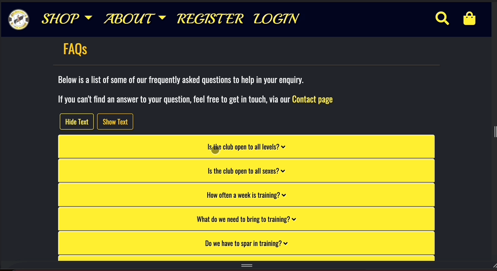
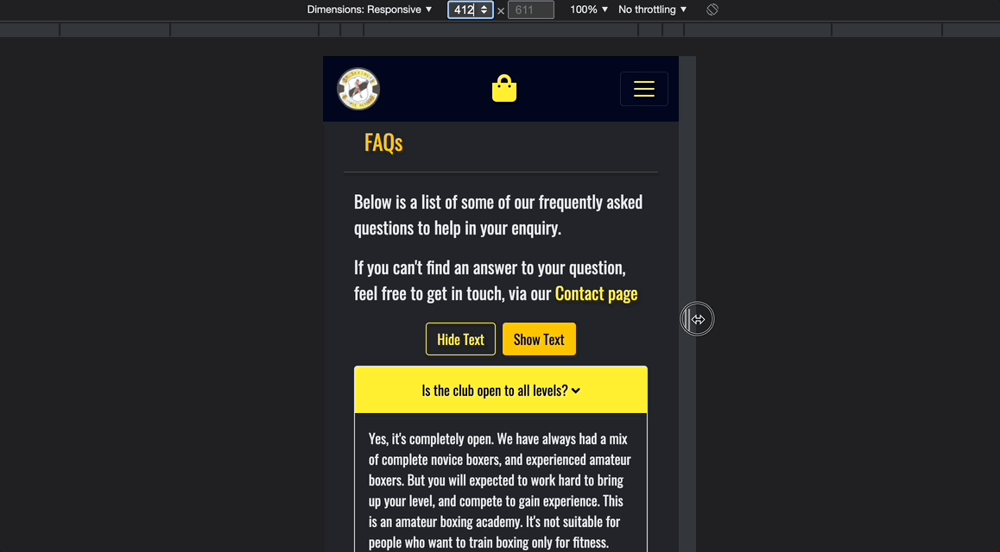

<div align='center'>

<h1> Testing </h1>
</div>

[Return to README file](README.md "Link to README file")

[View live project](https://saviours-oba.herokuapp.com/ "Link to Live project")

[View Repository](https://github.com/DaithiShan/saviours/ "Link to Repository")

***

### Table of contents
1. [Testing User Stories](#Testing-User-Stories)
2. [Manual Testing](#Manual-Testing)
    1. [Common Elements Testing](#Common-Elements-Testing)
    2. [Page Elements Testing](#Page-Elements-Testing)
3. [Automated Testing](#Automated-Testing) 
     - [Code Validation](#Code-Validation)
     - [Browser Validation](#Browser-Validation)
     - [Lighthouse Auditing](#Lighthouse-Auditing)
4. [User Testing](#User-Testing)

***

<div align='center'>

</div>

***

## Testing User Stories

User stories were tested to ensure the needs of the user were being met, with the following results:

### New Visitors

| **1. As a new visitor, I want to land on an engaging page, with very relevant calls to action.** |
|----------------------------------------------------------------------------|
- On `Store-Home`, new visitors see a waiting cornerstool, and 2 large buttons; `Get Membership` and `Get Gear`.
- `Get Membership` will direct new visitors to the `Membership` category view of the `Shop` page.
- `Get Gear` will direct new visitors to the `Membership` category view of the `Shop` page.
- This design choice prioritises the 2 highest traffic paths for aspiring boxers.
- A `View All` option is deliberately omitted, as it can erode intent. 

| **2. As a new visitor, I want to see all offers and content without first registering.** |
|----------------------------------------------------------------------------|
- On the `Shop Membership` page, new visitors can browse before registering.
- On the `Shop Gear` page, new visitors can browse before registering.
- On the `Shop Apparel` page, new visitors can browse before registering.
- Similarly, on `About` pages, new visitors can browse content before registering.

| **3. As a new visitor, I want to register my details when ordering, securely and quickly.** |
|----------------------------------------------------------------------------|
- Unauthenticated visitors will be redirected to `Login` on clicking `Add to Bag` or `View Bag`.
- On the `Login` page, any new visitors are targeted with text & a large `Sign Up Here` prompt.
- On the subsequent `Register` page, visitors only need to provide email, name & password.
- New visitors do not need to provide a username thanks to use of a custom user model.
- This design choice was made based on current UX trends for registration.

| **4. As a new visitor, I want to see contact info for the club, to communicate with staff team.** |
|----------------------------------------------------------------------------|
- For all new visitors, `The Club` is signposted as first link under `About` in Nav & Footer. 
- On `The Club`, new visitors can see and click to call the phone number for the Memberships Officer
- On `The Club`, new visitors can also click to email the Membership Officer and Club Secretary

| **5. As a new visitor, I want to navigate to a page that could help me with any questions** |
|----------------------------------------------------------------------------|
- For all new visitors, `Club FAQs`is signposted as second link under `About` in Nav & Footer.
- On `Club FAQs`, new visitors can scroll through a relevant list of questions and answers.
- If their question is omitted, new visitors will find `Contact Us` under `About`.
- New visitors can use `Contact Us` to submit a question if omitted from `Club FAQs`.

### Returning Visitors

| **1. As a returning visitor, I want to easily log into my existing account.** |
|----------------------------------------------------------------------------|
- All unauthenticated visitors will see a promoninent `Login` option in their Navbar.
- All unauthenticated visitors will be redirected to `Login` on `Add to Bag` or `View Bag`.
- The `Login` form takes only 2 parameters; email and password.
- This design choice was deliberate, as email is easier to remember than username.

| **2. As a returning visitor, I want to view my previous orders.** |
|----------------------------------------------------------------------------|
- All authenticated visitors will see a prominent `Account` option in their Navbar.
- Under `Account` on the Navbar, visitors can select `Order History`.
- Visitors can also select `Order History` from their `My Details` page.
- `Order History` lists all the order history of an authenticated visitor.

| **3. As a returning visitor, I want to check out quickly using my saved details.** |
|----------------------------------------------------------------------------|
- On checkout, all authenticated visitor have an option on the order form to click `Save address to my account`. 
- On clicking `Save address to my account`, the address in order form will save to their account details. 
- On navigating to `My Details`, the visitor can also click `Update Address`.
- If a returning visitor has entered an address at any point, it will be prepopulated in the order form.

| **4. As a returning user I want to be able to update my details.** |
|----------------------------------------------------------------------------|
- On navigating to `My Details`, returning visitors can `Edit Account Details`, `Update Address` or `Reset Password`
- On `Edit Account Details`, returning visitors can update their name and email address.
- On `Update Address`, returning visitors can update their shipping information.
- On `Reset Password`, returning visitors can update their password after email verification.

| **5. As a returning user I want to connect with the club on social media** |
|----------------------------------------------------------------------------|
- On the `Footer`, returning visitors can connect using links to the club's social media.
- On `The Club`, returning visitors can connect using links to the club's social media.

### General Visitors

| **1. As a visitor, I want to choose from a menu of membership options, particular to my own needs.** |
|----------------------------------------------------------------------------|
- On the Membership view of the `Shop` page, visitors can choose from a wide variety of membership options.
- On the `Footer`, all of these options are explicitly listed.

| **2. As a visitor, I want to filter through categories, to only see relevant products.** |
|----------------------------------------------------------------------------|
- On `Store-home`, visitors are presented with 2 button links and 3 thumbnail anchor links.
- By clicking `Get Membership` or `Get Gear`, visitors will filter products.
- By clicking links `Shop Membership`, `Shop Gear`, `Shop Apparel`, visitors will filter products.
- By clicking on `Shop` in the Navbar, visitors will be able to filter in this way as well.
- On any category view of `Shop`, visitors will be able to further filter using the sort button.
- Visitors can sort using this button by `Lowest Price` or `Recently Added`.

| **3. As a visitor, I want to use a search query, to find a specific product or product type.** |
|----------------------------------------------------------------------------|
- By clicking the `Search` icon on the Navbar, visitors will be redirected to `Search`.
- By entering a type query, visitors can search for a specific product, or a product type.
- For example, entering "gear" will bring up all products under the category "gear"
- For example, entering "gloves" will bring up specifically "boxing gloves".

| **4. As a visitor, I want to add, update, remove items in my shopping bag.** |
|----------------------------------------------------------------------------|
- By clicking the `Add to Bag`, visitors will generate a toast to confirm their action.
- By clicking the `Update` icon on the `Bag` page, visitors will generate a toast confirming their actions.
- By clicking the `Remove` icon on the `Bag` page, visitors will generate a toast confirming their actions.

| **5. As a visitor, I want to receive visual feedback when adding/updating/removing bag items** |
|----------------------------------------------------------------------------|
- By clicking the `Add to Bag`, visitors will generate a toast to confirm their action.
- By clicking the `Update` icon on the `Bag` page, visitors will generate a toast confirming their actions.
- By clicking the `Remove` icon on the `Bag` page, visitors will generate a toast confirming their actions.

| **6. As a visitor, I want to get real-time feedback on available stock, to make purchase decisions.** |
|----------------------------------------------------------------------------|
- On every `Product` page, visitors will see a stock count in the `Product Option`.
- After visitors update the quantity before clicking `Add to Bag`, stock will update.
- Visitors can update the quantity on the `Bag` page also, stock will update.
- Visitors will receive toast notifications on updating stock quantity.
- Visitors will not be able to select stock greater than listed availability.

| **7. As a visitor, I want to be able to proceed to a secure checkout, to make a purchase.** |
|----------------------------------------------------------------------------|
- On tbe `Bag` page, visitors can progress to checkout by clicking `Secure Checkout`.
- The site's e-commerce functionality uses an API call to Stripe.
- Stripe is one of the most secure modern payment processing platforms.

| **8. As a visitor, I want to review shopping bag before progressing in checking out process.** |
|----------------------------------------------------------------------------|
- The initial `Checkout` page allows visitors to review their order.
- On `Order Review`, visitors can choose to progress or return to the `Bag` page.
- On the `Bag` page, they can update or remove items before choosing to review again.

| **9. As a visitor, I want to be able to be able to edit my bag at all times.** |
|----------------------------------------------------------------------------|
- On `Order Review`, visitors can choose to return to bag to update or remove items.
- On `Order Details`, visitors can choose to edit bag to return and update/remove.

| **10. As a visitor, I want to be able to receive a summary of my order via email.** |
|----------------------------------------------------------------------------|
- After submitting the order on `Order Details`, visitors will trigger an email.
- The email will go to the email provided on the `Order Details` form.
- The email will contain a summary of the visitor's order.
- The order will also save to the visitor's Order History.
- On clicking `Order History` in the nav, a visitor will see a summary of past orders.


[Back to top ⇧](#table-of-contents)

***

## Manual Testing

### Common Elements Testing
Manual testing was conducted on the following elements that appear on every page:

- Clicking the Logo located on the top-left of the screen will redirect the user back to **Store-Home**:

    

- Hovering over the **Navigation Links** will trigger the hover effect, confirming the page the user is on:

    

- Collapsible `hamburger` button on mobile and tablet devices reveals **Navigation** menu:

    

- Navigational menu differs for authenticated and unauthenticated users:

    **Non-Registered User** <br />
    
 
    **Registered User** <br />
    

- Hovering over the **Footer** links will trigger the hover effect, confirming the action the user is about to take:
    
    

- Clicking the **Footer Social Icons** opens the social platform in a new tab:

    - **Facebook:** <br />
    


### Page Elements Testing

#### Home Page

Manual testing was conducted on the following elements on the **Home** Page:

- Clicking the **Category Links**, directs the user to their desired location:

    

- Home Page Responsiveness:

    

#### Shop Membership Page

Manual testing was conducted on the following elements on the **Shop Membership** Page:

- Clicking the **Breadcrumb Links**, directs the user back:

    

- Clicking the **Product Sort Button** sorts the membership bundles per the user's choice:

    

- Clicking a membership **Product** directs users to the product's details page:

    

- Shop Membership Responsiveness:

    

#### Shop Boxing Gear Page

Manual testing was conducted on the following elements on the **Shop Boxing Gear** Page:

- Clicking the **Breadcrumb Links**, directs the user back:

    

- Clicking the **Product Sort Button** sorts the Boxing Gear bundles per the user's choice:

    

- Clicking a Boxing Gear **Product** directs users to the product's details page:

    

- Shop Boxing Gear Responsiveness:

    

#### Shop Apparel Page

Manual testing was conducted on the following elements on the **Shop Boxing Gear** Page:

- Clicking the **Breadcrumb Links**, directs the user back:

    

- Clicking the **Product Sort Button** sorts the Boxing Gear bundles per the user's choice:

    

- Clicking an Apparel **Product** directs users to the product's details page:

    

- Shop Apparel Responsiveness:

    

#### Search Page

Manual testing was conducted on the following elements on the **Search** Page:

- Using the search bar, users will be provided with the appropriate response:

    **With Results** <br />
    

    **With No Results** <br />
    

- Clicking the **Search** title will reset the search:

    

- Clicking the **Category Buttons** directs the user to their desired category:

    

- Search Page Responsiveness:

    

#### Individual Product Page

Manual testing was conducted on the following elements on the **Individual Product** Page:

- Clicking the **Breadcrumb Links**, directs the user back:

    

- Clicking the **Dropdown** menu allows users to select their desired product variation (size or class time). providing stock count for each:

    

- Clicking the **Quantity Buttons** allows users to control their selected quantity:

    **Maximum** <br />
    

    **Minimum** <br />
    

- Clicking the **Add Rating** allows users to add their own rating, providing a toast for real-time feedback:providing a toast for real-time feedback:

    **Minimum** <br />
    

- Clicking the **Back Button** brings user to their previous page: 

    

- Clicking the **Add to Bag Button** adds the product to the user's bag, providing a toast for real-time feedback: 

    

- Individual Product Page Responsiveness:

    

#### Register Page

Manual testing was conducted on the following elements on the **Register** Page:

- Using the input fields, the user can enter their details and click the **Register** button, which will trigger form validation in case of errors.

    

- Using the input fields, the user can enter their details and click the **Register** button, which will trigger a toast in case of success.

    

- Register Page Responsiveness:

    

#### Login Page

Manual testing was conducted on the following elements on the **Login** Page:

- Using the input field, the user can enter their login details and click the **Login** button, which directs the user to the Home page:

    

- Clicking the **Register Button** directs the user to the sign up page:

    

- Login Page Responsiveness:

    

#### The Club Page

Manual testing was conducted on the following elements on **The Club** Page:

- Clicking the **Contact Links** opens a new tab:

    **Phone** <br />
    

    **Email** <br />
    

- Clicking the **Embedded Google Maps** allows the user to control the map:

    

- The Club Page Responsiveness:

    

#### FAQs Page

Manual testing was conducted on the following elements on the **FAQs** Page:

- Clicking the accordion titles opens the accordions, displaying information:

    

- Clicking **Hide/Show** all allows user control of the page:

    

- FAQs Page Responsiveness:

    

#### Contact Page

Manual testing was conducted on the following elements on the **Contact** Page:

- Sending a message on the contact form, provides real-time feedback to the user:

    

- Contact Page Responsiveness:

    

#### Shopping Bag Page

Manual testing was conducted on the following elements on the **Shopping Bag** Page:

- Clicking the **Breadcrumb Links**, directs the user back to the home page:

    

- Clicking the **Keep Shopping** button returns user to the All Products page:

    

- Clicking the `x` button removes the product from the bag:

    

- Clicking the **Quantity Buttons** allows users to control their selected quantity:

    **Maximum** <br />
    

    **Minimum** <br />
    

- Clicking the **Update Button** updates the bag with the user's selected quantity:

    

- Clicking the **Checkout Button** brings the user to the order review page:

    

- Shopping Bag Page Responsiveness:

    

#### Order Review Page

Manual testing was conducted on the following elements on the **Order Review** Page:

- Clicking the **Logo** returns the user to the shopping bag:

    

- Clicking **Return to Bag** returns the user to the shopping bag:

    

- Clicking the **Checkout Button** brings the user to the order details page:

    

- Order Review Page Responsiveness:

    

#### Order Details Page

Manual testing was conducted on the following elements on the **Order Details** Page:

- Clicking the **Logo** returns the user to the shopping bag:

    

- Clicking the **first circle** in the HUD returns the user to the Order Review page:

    

- Clicking **Edit Bag** returns the user to the shopping bag:

    

- On mobile devices, the order summary collapses for convienience:

    

- The input fields allow the user to enter their details and clicking the **Complete Order Button** brings the user to the order complete page:

    

#### User Account

Manual testing was conducted on the following elements on the **User Profile** Page:

- Clicking **Edit Details** allows the user to edit their details:

    

- Clicking **Update Address** allows the user to update their address:

    

- Clicking the **Delete Account** allows the user to delete their account:

    

- Clicking the **Order History Button** allows the user to view their order history:

    

- Clicking the **Reset Password Button** allows the user to reset their password:

    

- Clicking the **Contact Us Button** allows the user to contact the site admin:

    

- Clicking the **Logout Button** allows the user to log out:

    

- User Account Responsiveness:

    


[Back to top ⇧](#table-of-contents)

***

## Automated Testing

### Code Validation

- [W3C Markup Validator](https://validator.w3.org/ "Link to W3C Markup Validator") was used to validate the `HTML` code used, using the `Validate by URI` method.

    - `Duplicate ID` errors were highlighted on the `FAQs` pages. These are due to the iteration of database data and could not be modified (attempts were made to dynamically change the id according to the object, but the developer was unsuccessful in implementing this).

    - `Duplicate ID` error for  `id_select` in product page is due to the iteration of `product_select` objects.
    
    - All other highlighted errors were resolved.

-  [W3C CSS Validator](https://jigsaw.w3.org/css-validator/ "Link to W3C CSS Validator") was used to validate the `CSS` code used with the following result:

    - Errors highlighted in `strip_elements.js` pertain to [Stripe](https://stripe.com/en-ie "Link to Stripe Homepage") import:

        

    - There were no errors highlighted in `profile.js` or `base.js` files

- [PEP8 Online](http://pep8online.com/ "Link to PEP8 Online") was used to validate `Python` code.

    - A `line too long` linting error was highlighted in `settings.py` within the `AUTH_PASSWORD_VALIDATORS` variable (required by AllAuth).

    - Working with their mentor, the devloper decided to ignore this error as the lines could not be broken down without losing necessary password validation functionality, using the the [Flake8 Ignoring Violations](https://flake8.pycqa.org/en/latest/user/violations.html#in-line-ignoring-errors "Link to Flake8 docs") comment `# noqa`, with the final code as:

        ```
        AUTH_PASSWORD_VALIDATORS = [
            {
                'NAME': 'django.contrib.auth.password_validation.UserAttributeSimilarityValidator',  # noqa
            },
            {
                'NAME': 'django.contrib.auth.password_validation.MinimumLengthValidator',  # noqa
            },
            {
                'NAME': 'django.contrib.auth.password_validation.CommonPasswordValidator',  # noqa
            },
            {
                'NAME': 'django.contrib.auth.password_validation.NumericPasswordValidator',  # noqa
            },
        ]
        ```

    - All other highlighted errors and warnings were resolved.

### Browser Validation
**Chrome:**


**Safari:**


**Edge:**


**Opera:**


**Firefox:**


### Lighthouse Auditing

#### Desktop

[Back to top ⇧](#table-of-contents)

***

## User testing 
Family members and friends were asked to review the site and documentation to point out any bugs and/or user experience issues. Their helpful advice throughout the process led to many UX changes in order to create a better experience. 

[Back to top ⇧](#table-of-contents)

***